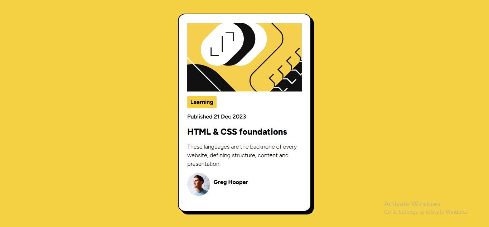
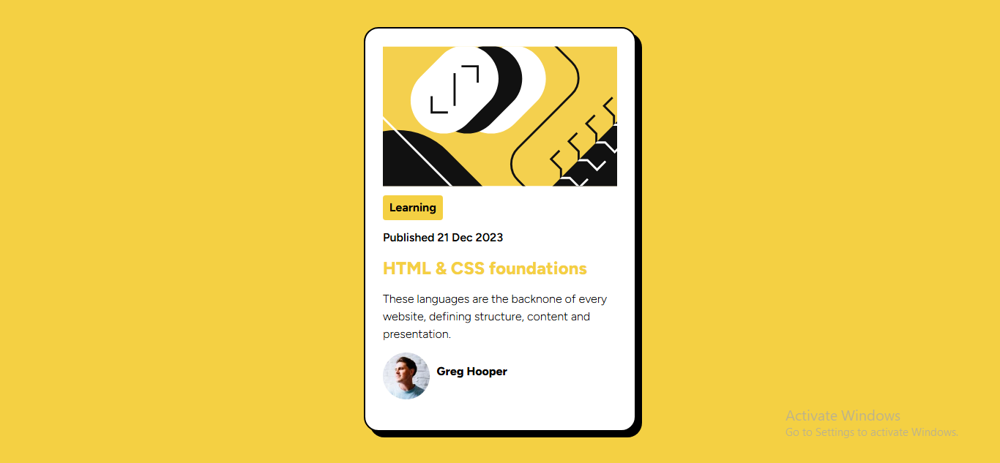

# Frontend Mentor - Blog preview card solution

This is a solution to the [Blog preview card challenge on Frontend Mentor](https://www.frontendmentor.io/challenges/blog-preview-card-ckPaj01IcS). Frontend Mentor challenges help you improve your coding skills by building realistic projects. 

## Table of contents

- [Overview](#overview)
  - [The challenge](#the-challenge)
  - [Screenshot](#screenshot)
  - [Links](#links)
  - [Built with](#built-with)
  - [What I learned](#what-i-learned)
  - [Continued development](#continued-development)
- [Author](#author)


## Overview
This is the second Frontend Mentor challenge where more of your css and html skills are put to test. It a challenge where you get to design a blog-preview card. The challenge can enforce your flex-box, positioning, grid and more of your css skills.

### The challenge

Users should be able to:

- See hover and focus states for all interactive elements on the page

### Screenshot





### Links

- Solution URL: [Add solution URL here](https://your-solution-url.com)
- Live Site URL: [Add live site URL here](https://your-live-site-url.com)

### Built with

- Semantic HTML5 markup
- CSS custom properties
- Flexbox

### What I learned

I learned how to use position relative and absolute and I also learned how to use transform which relly helped me in positioning the span element with the authors name.

```css
.author span {
  font-size: 16px;
  font-weight: 800;
  position: absolute;
  transform: translateY(90%) translateX(10%);
}

```
### Continued development

Next up is learning how to use css-grid and also animations, I am not comfortable with most JavaScript so that is an area I am really interested in continuing to learn as I improve my skills.

## Author

- Frontend Mentor - [@dAvvMaster](https://www.frontendmentor.io/profile/@dAvvMaster)
- Twitter - [@davv_cyber](https://www.twitter.com/@davv_cyber)

